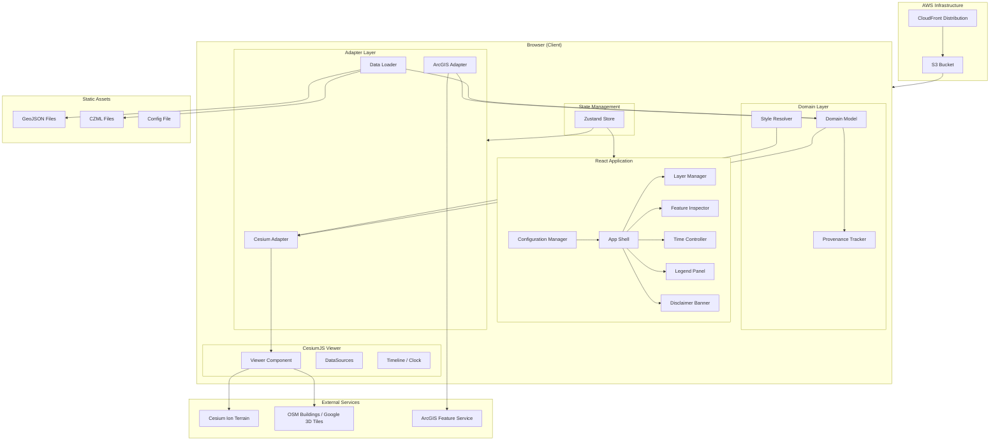
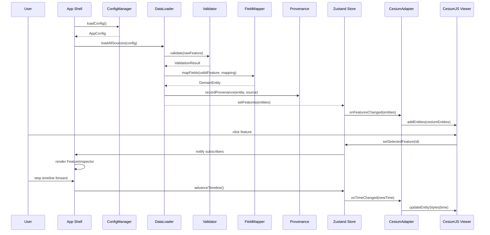
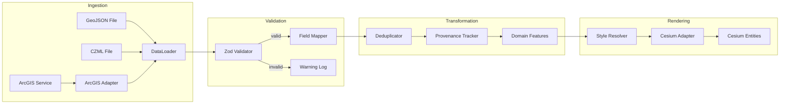
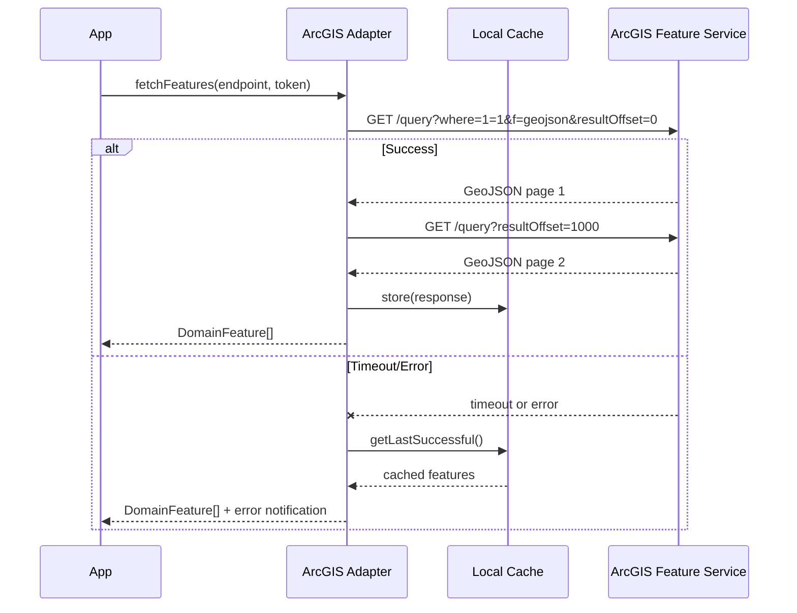

# Design Document: Urban ERW Digital Twin — Phase 1

## Overview

This design describes the Phase 1 demonstrator architecture for the Urban ERW Digital Twin — a browser-based 3D geospatial application that visualizes Explosive Remnants of War (ERW) hazards and humanitarian mine-action activities in complex urban environments. The system uses CesiumJS for 3D rendering, React + TypeScript for the UI layer, and Vite as the build toolchain. Data flows from GeoJSON files, CZML time-dynamic sources, and ArcGIS feature services through a domain-model layer into CesiumJS rendering primitives via adapter modules. Deployment targets AWS S3 + CloudFront using CDK.

### Key Design Decisions

1. **Resium** as the React-CesiumJS binding (declarative components wrapping CesiumJS primitives)
2. **Domain Model first** — all operational entities defined as plain TypeScript interfaces with zero CesiumJS coupling
3. **Adapter pattern** — dedicated modules translate domain objects into Cesium entities
4. **Configuration-driven** — tokens, providers, endpoints externalized via env vars with optional JSON config override
5. **vite-plugin-cesium** for static asset handling (workers, widgets, third-party libs)
6. **Zustand** for lightweight global state (layer visibility, timeline position, selection)
7. **Zod** for runtime data validation at ingestion boundaries
8. **AWS CDK v2** (TypeScript) for infrastructure-as-code

### Technology Stack

| Layer | Technology | Version |
|-------|-----------|---------|
| UI Framework | React | 18.x |
| Language | TypeScript | 5.x |
| Build | Vite | 5.x |
| 3D Engine | CesiumJS | 1.119+ |
| React-Cesium | Resium | 1.18+ |
| State | Zustand | 4.x |
| Validation | Zod | 3.x |
| IaC | AWS CDK | 2.x |
| Testing | Vitest + fast-check | latest |


## Architecture

### High-Level System Architecture




### Layered Architecture

The application follows a strict layered architecture with unidirectional dependency flow:

```
┌─────────────────────────────────────────────────┐
│  UI Layer (React Components)                     │
│  LayerManager, FeatureInspector, TimeController  │
│  LegendPanel, DisclaimerBanner                   │
├─────────────────────────────────────────────────┤
│  State Layer (Zustand)                           │
│  AppStore: layers, timeline, selection, config   │
├─────────────────────────────────────────────────┤
│  Adapter Layer                                   │
│  CesiumAdapter, ArcGISAdapter, DataLoader        │
├─────────────────────────────────────────────────┤
│  Domain Layer                                    │
│  DomainModel, StyleResolver, ProvenanceTracker   │
│  Validators, FieldMapper                         │
├─────────────────────────────────────────────────┤
│  Infrastructure (CDK)                            │
│  S3, CloudFront, OAC                             │
└─────────────────────────────────────────────────┘
```

**Dependency Rule**: Each layer may only import from layers below it. The Domain Layer has zero external dependencies (no CesiumJS, no React). The Adapter Layer bridges Domain ↔ CesiumJS. The UI Layer consumes state and renders.

### Directory Structure

```
urban-erw-digital-twin/
├── app/
│   ├── src/
│   │   ├── domain/           # Domain model interfaces, validators, field mapper
│   │   │   ├── models/       # TypeScript interfaces (HazardArea, Route, etc.)
│   │   │   ├── validators/   # Zod schemas and validation logic
│   │   │   ├── mapping/      # Field mapping configuration and mapper
│   │   │   ├── provenance/   # Provenance tracker
│   │   │   └── style/        # Style resolver (status → style config)
│   │   ├── adapters/         # CesiumJS adapter, ArcGIS adapter, DataLoader
│   │   │   ├── cesium/       # Domain → Cesium entity transforms
│   │   │   ├── arcgis/       # ArcGIS REST client + response mapper
│   │   │   └── loaders/      # GeoJSON/CZML file loaders
│   │   ├── state/            # Zustand store slices
│   │   ├── components/       # React UI components
│   │   │   ├── viewer/       # Resium Viewer wrapper
│   │   │   ├── panels/       # FeatureInspector, LegendPanel
│   │   │   ├── controls/     # LayerManager, TimeController
│   │   │   └── common/       # DisclaimerBanner, ErrorNotification
│   │   ├── config/           # Configuration manager
│   │   ├── hooks/            # Custom React hooks
│   │   └── main.tsx          # Entry point
│   ├── public/
│   │   └── data/             # Bundled synthetic GeoJSON/CZML
│   ├── index.html
│   ├── vite.config.ts
│   ├── tsconfig.json
│   └── package.json
├── infra/
│   └── cdk/
│       ├── lib/              # CDK stack definition
│       ├── bin/              # CDK app entry
│       └── package.json
├── docs/
│   ├── architecture/
│   ├── adr/
│   ├── data-model/
│   └── deployment/
└── README.md
```


## Components and Interfaces

### Component Interaction Diagram



### Core React Components

| Component | Responsibility | Props / State Source |
|-----------|---------------|-------------------|
| `AppShell` | Layout orchestrator, error boundary | ConfigManager output |
| `ViewerContainer` | Resium `<Viewer>` wrapper, camera presets | Store: config, features |
| `LayerManager` | Toggle panel for layer groups | Store: layerVisibility |
| `FeatureInspector` | Side panel showing selected feature metadata | Store: selectedFeature |
| `TimeController` | Timeline scrubber, play/pause/step | Store: timelineState |
| `LegendPanel` | Dynamic legend keyed to visible layers | Store: layerVisibility |
| `DisclaimerBanner` | Persistent non-dismissible banner | Static content |
| `ErrorNotification` | Toast-style error/retry for failed layers | Store: errors |
| `ComparisonMode` | Before/after toggle overlay | Store: comparisonState |


### Key Algorithms

#### 1. Status-at-Time Resolution

The core algorithm for determining feature status at any given timeline position:

```typescript
function getStatusAtTime(
  statusHistory: StatusHistoryEntry[],
  currentTime: Date,
  defaultStatus: string
): string {
  // statusHistory is sorted by effectiveTime ascending
  // Find the last entry whose effectiveTime <= currentTime
  let resolvedStatus = defaultStatus;
  for (const entry of statusHistory) {
    if (entry.effectiveTime <= currentTime) {
      resolvedStatus = entry.newStatus;
    } else {
      break; // entries are sorted, no need to continue
    }
  }
  return resolvedStatus;
}
```

#### 2. Event Boundary Navigation (Step Forward/Backward)

```typescript
function getNextEventBoundary(
  events: ScenarioEvent[],
  currentTime: Date
): Date | null {
  // Find the first event whose time is strictly after currentTime
  for (const event of events) {
    if (event.time > currentTime) return event.time;
  }
  return null; // already at end
}

function getPreviousEventBoundary(
  events: ScenarioEvent[],
  currentTime: Date
): Date | null {
  // Find the last event whose time is strictly before currentTime
  for (let i = events.length - 1; i >= 0; i--) {
    if (events[i].time < currentTime) return events[i].time;
  }
  return null; // already at start
}
```

#### 3. Field Mapping

```typescript
function mapFields(
  rawProperties: Record<string, unknown>,
  mapping: FieldMappingConfig
): { mapped: Partial<DomainFields>; unmapped: Record<string, unknown> } {
  const mapped: Partial<DomainFields> = {};
  const unmapped: Record<string, unknown> = {};

  for (const [sourceKey, value] of Object.entries(rawProperties)) {
    const targetField = mapping[sourceKey];
    if (targetField) {
      mapped[targetField] = value;
    } else {
      unmapped[sourceKey] = value;
    }
  }
  return { mapped, unmapped };
}
```

#### 4. Duplicate Resolution

```typescript
function deduplicateFeatures(features: DomainFeature[]): DomainFeature[] {
  const byId = new Map<string, DomainFeature>();
  for (const feature of features) {
    const existing = byId.get(feature.id);
    if (!existing || feature.lastUpdated > existing.lastUpdated) {
      byId.set(feature.id, feature);
    }
  }
  return Array.from(byId.values());
}
```

#### 5. Configuration Resolution (Env > File)

```typescript
function resolveConfig(
  envVars: Record<string, string | undefined>,
  fileConfig: Partial<AppConfig> | null
): AppConfig | ConfigError {
  const merged: Record<string, unknown> = {};
  for (const key of ALL_CONFIG_KEYS) {
    merged[key] = envVars[envKey(key)] ?? fileConfig?.[key] ?? undefined;
  }
  const missing = REQUIRED_KEYS.filter(k => merged[k] === undefined);
  if (missing.length > 0) return { error: 'missing', keys: missing };
  return merged as AppConfig;
}
```


## Data Models

### Domain Model Interfaces

All interfaces below are pure TypeScript — zero CesiumJS imports.

```typescript
// ─── Core Enums ───────────────────────────────────────────────

export type HazardStatus =
  | 'suspected' | 'confirmed' | 'restricted' | 'surveyed' | 'cleared';

export type RouteStatus =
  | 'primary' | 'restricted' | 'blocked' | 'reopened';

export type EvidenceType =
  | 'direct_evidence' | 'indirect_evidence' | 'victim_report'
  | 'informant_testimony' | 'technical_survey_finding';

export type SensitivityLevel =
  | 'category_a_synthetic' | 'category_a_public' | 'category_b_restricted';

export type ScenarioPhase =
  | 'initial_state' | 'survey' | 'clearance' | 'post_clearance';

export type ClearanceTaskStatus =
  | 'planned' | 'in_progress' | 'completed' | 'suspended';

// ─── Geometry ─────────────────────────────────────────────────

export interface GeoPosition {
  longitude: number; // degrees
  latitude: number;  // degrees
  altitude?: number; // meters above ellipsoid
}

export interface GeoPolygon {
  type: 'Polygon';
  coordinates: GeoPosition[][];  // outer ring + optional holes
}

export interface GeoLineString {
  type: 'LineString';
  coordinates: GeoPosition[];
}

export interface GeoPoint {
  type: 'Point';
  coordinates: GeoPosition;
}

export type Geometry = GeoPolygon | GeoLineString | GeoPoint;

// ─── Status History ───────────────────────────────────────────

export interface StatusHistoryEntry {
  effectiveTime: Date;
  previousStatus: string;
  newStatus: string;
  source: string;
  confidence: number; // 0.0 – 1.0
}

// ─── Provenance ───────────────────────────────────────────────

export interface ProvenanceRecord {
  sourceId: string;
  ingestionTimestamp: Date; // ISO 8601
  transformationSteps: string[];
  sensitivityLevel: SensitivityLevel | 'unclassified';
}

// ─── Base Feature ─────────────────────────────────────────────

export interface BaseFeature {
  id: string;
  featureType: string;
  name?: string;
  status: string;
  validFrom?: Date;
  validTo?: Date;
  responsibleOrganization?: string;
  confidence?: number; // 0.0 – 1.0
  sensitivityLevel?: SensitivityLevel;
  statusHistory: StatusHistoryEntry[];
  provenance?: ProvenanceRecord;
  unmappedProperties: Record<string, unknown>;
  isSynthetic: boolean;
  sourceIdentifier?: string; // original ArcGIS ObjectID/GlobalID
}

// ─── Concrete Feature Types ──────────────────────────────────

export interface HazardArea extends BaseFeature {
  featureType: 'hazard_area';
  status: HazardStatus | string; // allows unrecognized for graceful degradation
  geometry: GeoPolygon;
}

export interface EvidencePoint extends BaseFeature {
  featureType: 'evidence_point';
  evidenceType: EvidenceType | string;
  description?: string;
  geometry: GeoPoint;
}

export interface ClearanceTask extends BaseFeature {
  featureType: 'clearance_task';
  status: ClearanceTaskStatus | string;
  geometry: GeoPolygon;
}

export interface Route extends BaseFeature {
  featureType: 'route';
  status: RouteStatus | string;
  routeIdentifier?: string;
  geometry: GeoLineString;
}

export interface CriticalInfrastructure extends BaseFeature {
  featureType: 'critical_infrastructure';
  infrastructureType: string; // school, medical, utility, etc.
  geometry: GeoPoint | GeoPolygon;
}

export type DomainFeature =
  | HazardArea
  | EvidencePoint
  | ClearanceTask
  | Route
  | CriticalInfrastructure;
```


### Configuration Model

```typescript
export interface AppConfig {
  cesiumIonToken: string;          // required
  urbanContextProvider: 'cesium-world-terrain' | 'google-3d-tiles'; // required
  dataServiceEndpoints: string[];  // at least one required
  arcgisFeatureServiceUrl?: string;
  arcgisFieldMapping?: string;     // path to mapping JSON
  environment: string;             // e.g., 'development', 'production'
  demoMode: boolean;
  defaultCameraPosition: CameraPosition;
  scenarioTimeRange: { start: Date; end: Date };
}

export interface CameraPosition {
  longitude: number;
  latitude: number;
  altitude: number;
  heading: number;
  pitch: number;
  roll: number;
}
```

### Field Mapping Configuration

```typescript
export interface FieldMappingConfig {
  [sourceFieldName: string]: keyof BaseFeature | undefined;
}

// Example mapping for ArcGIS → Domain:
// {
//   "OBJECTID": "sourceIdentifier",
//   "GlobalID": "id",
//   "HazardStat": "status",
//   "ValidFrom": "validFrom",
//   "ValidTo": "validTo",
//   "OrgName": "responsibleOrganization",
//   "Confidence": "confidence"
// }
```

### Style Model

```typescript
export interface FeatureStyle {
  fillColor: string;        // CSS color or Cesium Color
  outlineColor: string;
  outlineWidth: number;
  pattern?: 'solid' | 'hatched' | 'crosshatched' | 'dotted';
  linePattern?: 'solid' | 'dashed' | 'dotted' | 'dash-dot';
  icon?: string;            // icon asset path for point features
  label?: string;           // supplementary text label
  badgeIcon?: string;       // e.g., Category B indicator
}

export interface StyleConfig {
  hazardArea: Record<HazardStatus, FeatureStyle>;
  route: Record<RouteStatus, FeatureStyle>;
  clearanceTask: Record<ClearanceTaskStatus, FeatureStyle>;
  evidencePoint: Record<EvidenceType, FeatureStyle>;
  criticalInfrastructure: Record<string, FeatureStyle>;
  defaults: {
    unknownStatus: FeatureStyle;
    unknownEvidenceType: FeatureStyle;
  };
}
```

### State Model (Zustand)

```typescript
export interface AppState {
  // Configuration
  config: AppConfig | null;
  configError: string | null;

  // Features
  features: DomainFeature[];
  featuresByLayer: Record<LayerGroup, DomainFeature[]>;

  // Layer visibility
  layerVisibility: Record<LayerGroup, boolean>;
  toggleLayer: (layer: LayerGroup) => void;

  // Timeline
  currentTime: Date;
  isPlaying: boolean;
  scenarioEvents: ScenarioEvent[];
  currentPhase: ScenarioPhase;
  stepForward: () => void;
  stepBackward: () => void;
  play: () => void;
  pause: () => void;
  seekTo: (time: Date) => void;

  // Selection
  selectedFeatureId: string | null;
  selectFeature: (id: string | null) => void;

  // Comparison mode
  comparisonActive: boolean;
  toggleComparison: () => void;

  // Errors
  layerErrors: Record<string, LayerError>;
  dismissError: (layerId: string) => void;
  retryLayer: (layerId: string) => void;

  // Reset
  resetToDefaults: () => void;
}

export type LayerGroup =
  | 'urban_context' | 'hazards' | 'survey' | 'evidence'
  | 'clearance' | 'routes' | 'infrastructure' | 'boundaries';

export interface ScenarioEvent {
  time: Date;
  featureId: string;
  newStatus: string;
  phase: ScenarioPhase;
}

export interface LayerError {
  layerName: string;
  message: string;
  timestamp: Date;
  retryCount: number;
}
```


### Data Flow



**Ingestion Pipeline Steps:**
1. Raw data loaded from source (GeoJSON file, CZML file, or ArcGIS REST response)
2. Each feature validated against Zod schema (geometry type, required fields, date formats)
3. Valid features mapped through field-mapping configuration → domain fields
4. Duplicate IDs resolved (keep most recent `lastUpdated`)
5. Provenance record attached (source, timestamp, transformations applied)
6. Domain features stored in Zustand store, partitioned by layer group
7. Cesium Adapter transforms domain features to Cesium entities with resolved styles
8. CZML files loaded directly via CesiumJS `CzmlDataSource` for native time-interval handling

### ArcGIS Integration Pattern



The ArcGIS adapter queries with `f=geojson` output format and paginates using `resultOffset` and `resultRecordCount` until all features are retrieved (detected when returned count < maxRecordCount).


## Correctness Properties

*A property is a characteristic or behavior that should hold true across all valid executions of a system — essentially, a formal statement about what the system should do. Properties serve as the bridge between human-readable specifications and machine-verifiable correctness guarantees.*

### Property 1: Status-at-Time Resolution

*For any* feature with a non-empty status history (sorted by effective time) and *for any* time value T, the resolved status at time T shall equal the `newStatus` of the last history entry whose `effectiveTime` is less than or equal to T, or the default status if no such entry exists.

**Validates: Requirements 4.2, 7.2, 13.2, 13.3, 13.4**

### Property 2: Style Uniqueness per Status

*For any* two distinct status values within the same feature type (Hazard_Area, Route, Clearance_Task), the style resolver shall produce style objects that differ in at least two visual dimensions (color AND pattern/icon/label), such that no two statuses share the same (fillColor, supplementaryDifferentiator) combination.

**Validates: Requirements 4.1**

### Property 3: Metadata Formatting Completeness

*For any* domain feature with an arbitrary subset of optional fields populated, the metadata formatter shall include exactly those fields that are present (non-null, non-undefined) in the formatted output, and shall omit all fields that are absent.

**Validates: Requirements 9.1, 9.3**

### Property 4: Status History Chronological Ordering

*For any* status history list with N entries (N > 0), the formatted display output shall present entries in ascending order of `effectiveTime`, such that for all consecutive pairs (i, i+1), entry[i].effectiveTime <= entry[i+1].effectiveTime.

**Validates: Requirements 9.2**

### Property 5: Event Boundary Navigation

*For any* sorted list of scenario events and *for any* current time T within the scenario range, `getNextEventBoundary(events, T)` shall return the time of the first event strictly after T (or null if T >= last event time), and `getPreviousEventBoundary(events, T)` shall return the time of the last event strictly before T (or null if T <= first event time).

**Validates: Requirements 12.2, 12.3**

### Property 6: Time-to-Phase Mapping

*For any* time T within the scenario time range, the phase resolver shall return exactly one `ScenarioPhase` label consistent with the phase boundaries, such that adjacent phases do not overlap and together cover the entire time range.

**Validates: Requirements 12.4**


### Property 7: GeoJSON Parse Validity — Valid Features Preserved, Invalid Features Skipped

*For any* GeoJSON FeatureCollection containing N valid features and M invalid features (where validity is defined as: has unique ID, recognized geometry type, recognized status, valid ISO 8601 dates), the data loader shall produce exactly N domain objects and log exactly M warnings, preserving all valid features and discarding all invalid ones.

**Validates: Requirements 15.1, 15.2, 24.1, 24.2**

### Property 8: Field Mapping Correctness

*For any* raw feature properties object and *for any* valid field-mapping configuration, the field mapper shall produce a mapped result where every key present in both the properties and the mapping appears in the mapped output with its original value, and every key present in the properties but not in the mapping appears in the unmapped output.

**Validates: Requirements 15.3, 15.4, 17.2**

### Property 9: Source Identifier Preservation

*For any* ArcGIS feature containing an ObjectID or GlobalID field, the resulting domain feature shall have `sourceIdentifier` set to the original value from the ArcGIS response, unchanged through all transformation steps.

**Validates: Requirements 17.3**

### Property 10: Provenance Recording Completeness

*For any* feature processed through the ingestion pipeline from a data source with identifier S, the resulting provenance record shall contain: sourceId equal to S, an ingestionTimestamp that is a valid ISO 8601 datetime no earlier than the ingestion start time, and a non-empty ordered list of transformation step descriptions matching the operations actually performed.

**Validates: Requirements 18.1**

### Property 11: Configuration Resolution Precedence

*For any* configuration key K where both an environment variable and a config file entry provide a value, the resolved configuration shall equal the environment variable value. For any key K where only the config file provides a value, the resolved configuration shall equal the config file value.

**Validates: Requirements 21.1**

### Property 12: Configuration Validation — Missing Required Keys

*For any* subset of required configuration keys that is a proper subset (i.e., at least one required key is missing), the configuration validator shall reject the configuration and return an error listing exactly the missing required key names.

**Validates: Requirements 21.2**

### Property 13: Duplicate Resolution by Timestamp

*For any* collection of features where two or more features share the same ID but have distinct `lastUpdated` timestamps, the deduplicator shall retain exactly one feature per ID — the one with the most recent (largest) `lastUpdated` value.

**Validates: Requirements 24.3**

### Property 14: Source-Level Validation Warning Threshold

*For any* data source containing N total features where the count of features failing validation exceeds N/2, the data loader shall emit a source-level warning. For any data source where the failure count is N/2 or fewer, no source-level warning shall be emitted.

**Validates: Requirements 24.4**


## Error Handling

### Error Handling Strategy

The application employs a tiered error handling approach:

| Error Category | Response | User Impact |
|---------------|----------|-------------|
| **Fatal** (missing config, WebGL unsupported) | Block initialization, show full-page error | Cannot use app |
| **Layer Load Failure** (network, invalid data) | Non-modal toast notification, retry control | Other layers functional |
| **Provider Failure** (terrain, buildings) | Non-blocking notification, degrade to flat ellipsoid | Reduced visual context |
| **Feature Validation** (bad record) | Skip feature, log warning | Missing individual features |
| **ArcGIS Failure** (timeout, auth) | Notification, fall back to cache | Stale data possible |
| **CZML Parse Error** (bad packet) | Skip packet, log warning | Missing time-dynamic features |

### Error Notification Component

```typescript
interface ErrorNotification {
  id: string;
  layerName: string;
  message: string;
  severity: 'error' | 'warning' | 'info';
  timestamp: Date;
  dismissible: boolean;
  retryAction?: () => Promise<void>;
  autoHideMs?: number; // minimum 10000ms for errors
}
```

### Graceful Degradation Chain

```
Urban Context Provider fails → Flat ellipsoid + no buildings (app continues)
    ↓
One data layer fails → All other layers render (retry available)
    ↓
ArcGIS timeout → Use cached data (notify user of staleness)
    ↓
> 50% validation failures → Source-level warning logged
    ↓
Individual feature invalid → Skip, log, continue
```

### Error Boundaries

React error boundaries wrap:
1. **ViewerContainer** — catches CesiumJS rendering errors, shows fallback with reload option
2. **FeatureInspector** — catches rendering errors for malformed metadata, shows "Unable to display feature" message
3. **DataLoader** — catches unhandled ingestion errors, surfaces via notification system

### Logging

All validation warnings, skipped features, and error events are logged to the browser console with structured metadata:

```typescript
interface LogEntry {
  level: 'info' | 'warn' | 'error';
  component: string;        // e.g., 'DataLoader', 'ArcGISAdapter'
  message: string;
  featureId?: string;       // or index if ID unavailable
  source?: string;          // data source identifier
  reason?: string;          // failure reason
  timestamp: Date;
}
```


## Testing Strategy

### Dual Testing Approach

The testing strategy combines property-based tests (PBT) for universal correctness guarantees with example-based unit tests for specific scenarios, edge cases, and integration points.

### Property-Based Testing

**Library**: `fast-check` (TypeScript PBT library for Vitest)

**Configuration**:
- Minimum 100 iterations per property test
- Each test tagged with design property reference
- Tag format: `Feature: urban-erw-digital-twin, Property {N}: {title}`

**Properties to Implement** (14 total — see Correctness Properties section):

| Property | Module Under Test | Generator Strategy |
|----------|------------------|-------------------|
| 1: Status-at-Time | `domain/models/getStatusAtTime` | Random sorted StatusHistoryEntry[], random Date |
| 2: Style Uniqueness | `domain/style/resolveStyle` | Enumerate all status pairs per feature type |
| 3: Metadata Formatting | `components/panels/formatMetadata` | Random BaseFeature with optional fields |
| 4: Status History Order | `components/panels/formatStatusHistory` | Random unsorted StatusHistoryEntry[] |
| 5: Event Boundary Navigation | `state/timeline/getNextEvent` | Random sorted ScenarioEvent[], random Date |
| 6: Time-to-Phase Mapping | `state/timeline/getPhaseAtTime` | Random Date within scenario bounds |
| 7: GeoJSON Parse Validity | `adapters/loaders/parseGeoJSON` | Random FeatureCollection with mix valid/invalid |
| 8: Field Mapping | `domain/mapping/mapFields` | Random properties + random mapping config |
| 9: Source ID Preservation | `adapters/arcgis/mapArcGISFeature` | Random ArcGIS response with ObjectID/GlobalID |
| 10: Provenance Recording | `domain/provenance/recordProvenance` | Random features + random source metadata |
| 11: Config Precedence | `config/resolveConfig` | Random env vars + random file config |
| 12: Config Validation | `config/validateConfig` | Random config missing required keys |
| 13: Duplicate Resolution | `adapters/loaders/deduplicateFeatures` | Random features with duplicate IDs, distinct timestamps |
| 14: Validation Threshold | `adapters/loaders/checkSourceHealth` | Random N total, random M invalid (M/N ratio varies) |

### Example-Based Unit Tests

Focus areas:
- **Edge cases**: Empty status history, zero features, all layers off, timeline at boundary
- **Error conditions**: WebGL detection, malformed config, timeout mocking
- **UI state**: Default layer visibility, reset to initial state, comparison mode toggle
- **Accessibility**: ARIA roles, contrast ratios (via jest-axe), keyboard navigation handlers
- **Synthetic data validation**: Verify bundled data meets content requirements (Req 26)

### Integration Tests

- CesiumJS rendering of GeoJSON/CZML via Resium (headless with puppeteer or playwright)
- ArcGIS adapter against mock endpoint (MSW - Mock Service Worker)
- Full page load performance (LCP < 10s on simulated broadband)
- Cross-browser verification (Playwright with chromium, firefox, webkit)

### Infrastructure Tests (CDK)

- CDK assertion tests verifying:
  - S3 bucket is private (no public access)
  - CloudFront has HTTPS redirect
  - OAC configured between CloudFront and S3
  - Custom error responses for SPA routing (403 → index.html, 404 → index.html)
  - No secrets in synthesized template

### Test Organization

```
app/
├── src/
│   ├── domain/
│   │   └── __tests__/           # Domain model unit + property tests
│   ├── adapters/
│   │   └── __tests__/           # Adapter unit + property tests
│   ├── state/
│   │   └── __tests__/           # State logic + property tests
│   ├── components/
│   │   └── __tests__/           # Component unit tests (React Testing Library)
│   └── config/
│       └── __tests__/           # Config resolution property + unit tests
├── tests/
│   ├── integration/             # E2E with Playwright
│   └── performance/             # Performance benchmarks
infra/
└── cdk/
    └── test/                    # CDK assertion tests
```

### Test Commands

```bash
# Unit + Property tests (fast)
pnpm test                    # vitest --run

# Integration tests
pnpm test:integration        # playwright test

# CDK tests
cd infra/cdk && pnpm test    # jest --run (CDK assertions)

# All tests
pnpm test:all
```

